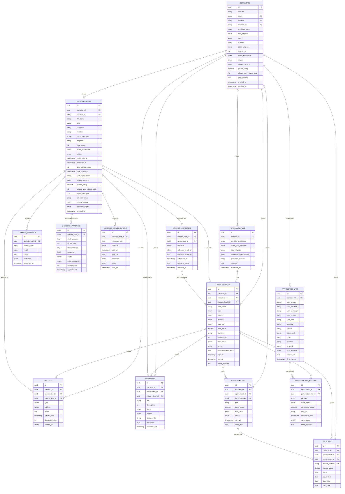
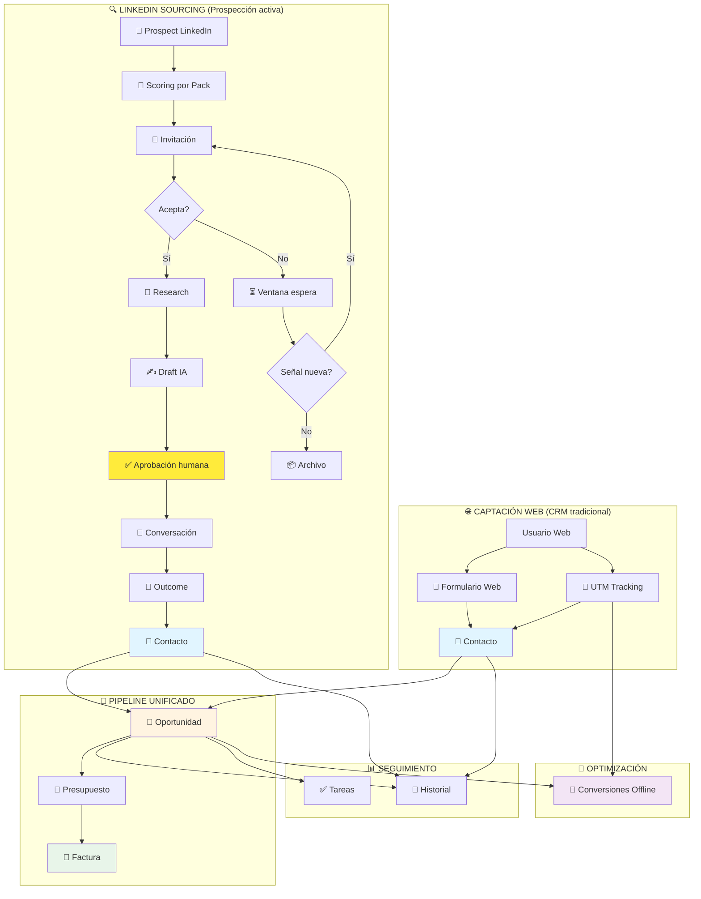
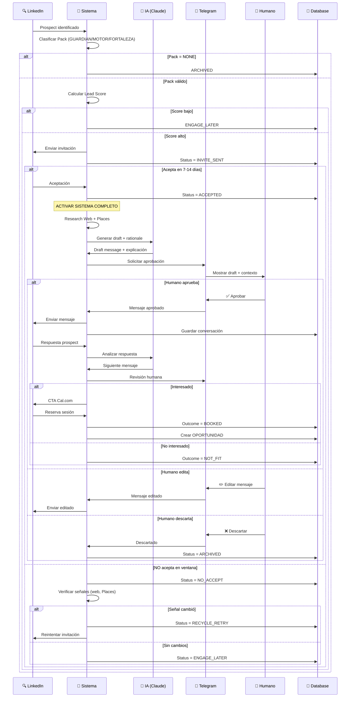
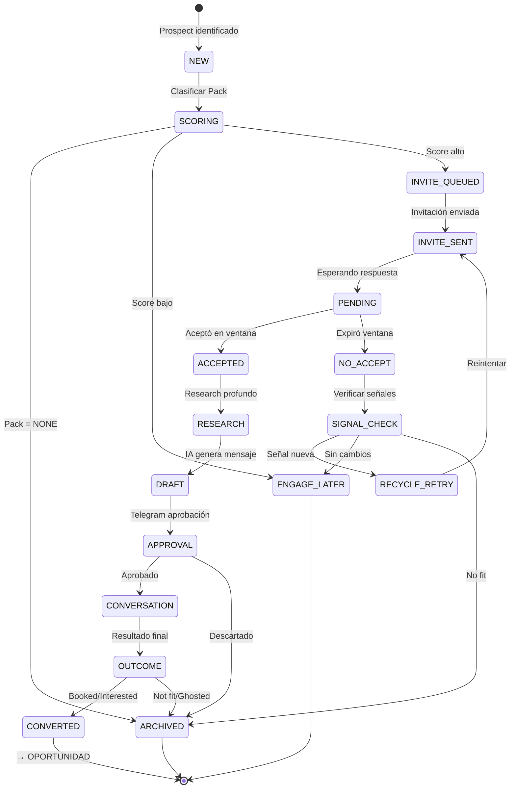

# CRM + LinkedIn Stealth Sourcing - Diagrama ERD

## 📊 Diagrama Entidad-Relación Completo



## 🔄 Flujo Dual: CRM Tradicional + LinkedIn Sourcing



## 📈 Flujo LinkedIn Sourcing (Detallado)



## 🎯 Estados del LinkedIn Lead



## 🔑 Tablas Core (Imprescindibles para Budibase)

### 1. **CONTACTOS** 👤
- **Centro del sistema**
- Unifica leads web + LinkedIn
- Deduplicación: email OR linkedin_url OR teléfono
- Soporta: pack_asignado, lead_score, Places data

### 2. **OPORTUNIDADES** 💼
- **Pipeline unificado**
- Origen dual: formulario_id OR linkedin_lead_id
- Estados: Nuevo → Ganado/Perdido
- Pack sincronizado con contacto

### 3. **HISTORIAL** 🧾
- **Timeline universal**
- Soporta: contacto_id, oportunidad_id, linkedin_lead_id
- Tipos incluyen: LINKEDIN_MESSAGE, LINKEDIN_INVITE

### 4. **PENDIENTES** ✅
- **Tareas universales**
- Soporta: contacto_id, oportunidad_id, linkedin_lead_id
- Critical para seguimientos LinkedIn

## 🎨 Tablas LinkedIn Sourcing (Preparadas para futuro)

### 5. **LINKEDIN_LEADS** 🔍
- **Gestión completa del proceso**
- Estados: NEW → ACCEPTED → CONVERTED
- Scoring por pack, A/B testing, señales web/Places
- Ventana de espera, reciclaje inteligente

### 6. **LINKEDIN_ATTEMPTS** 📝
- **Auditoría completa**
- Todos los intentos: invite, message, research, signal_check
- Resultados: sent, skipped, failed, blocked

### 7. **LINKEDIN_APPROVALS** ✅
- **Control humano (Telegram)**
- Draft IA + rationale
- Feedback estructurado: angle, pain, note

### 8. **LINKEDIN_CONVERSATIONS** 💬
- **Historial de mensajes**
- Dirección: SENT / RECEIVED
- Análisis futuro: sentiment, intent

### 9. **LINKEDIN_OUTCOMES** 🎯
- **Resultados finales**
- BOOKED / INTERESTED_LATER / NOT_FIT / GHOSTED
- Tracking de Cal.com events

## 📋 Pantallas Budibase Recomendadas

### 🏠 Dashboard Principal
**Objetivo:** Vista 360° del negocio

**Widgets:**
- 📊 Pipeline por estado (gráfico embudo)
- 💰 Revenue mes actual vs anterior
- ✅ Mis tareas de hoy (vencidas en rojo)
- 📈 Funnel: Leads → Oportunidades → Ganados
- 🎯 (Futuro) LinkedIn: Invites sent → Acceptance rate → Booked

### 👥 Contactos
**Objetivo:** Base de datos central

**Features:**
- 🔍 Búsqueda fuzzy (nombre, empresa, email)
- 🏷️ Filtros: tipo_empresa, pack_asignado, origen
- 📊 Vista detalle:
  - Datos básicos + LinkedIn + Places
  - Timeline unificado (historial + formularios)
  - Oportunidades relacionadas
  - UTM tracking (si origen web)
  - (Futuro) LinkedIn lead status

### 💼 Pipeline (Kanban)
**Objetivo:** Gestión visual de oportunidades

**Columnas:**
- Nuevo
- En contacto
- Presupuesto enviado
- Negociación
- Ganado
- Perdido

**Features:**
- Drag & drop para cambiar estado
- Filtros: owner, pack, valor
- Color por prioridad
- Detalle: contacto, valor, next_action, fechas

### 📅 Calendario
**Objetivo:** Tareas y reuniones

**Features:**
- Vista mensual/semanal
- Código de colores por prioridad
- Alertas de vencimientos
- Filtro por assigned_to
- (Futuro) Cal.com events integrados

### 📄 Presupuestos
**Objetivo:** Generación y tracking

**Features:**
- Generador con plantilla
- Estado visual: Draft/Sent/Accepted/Rejected
- Versiones múltiples por oportunidad
- Alerta de expiración
- Generación PDF (Supabase Storage)

### 🧾 Facturas
**Objetivo:** Control de cobros

**Features:**
- Dashboard: Pending/Paid/Overdue
- Alertas de vencimiento (push notifications)
- Filtros: estado, cliente, fecha
- Gráfico: Revenue mensual
- DSO (Days Sales Outstanding)

### 📊 Analytics
**Objetivo:** Inteligencia de negocio

**Dashboards:**
- **Funnel:**
  - Formularios → Oportunidades → Ganados
  - Tasas de conversión por servicio
  - (Futuro) LinkedIn: Invites → Accepts → Booked

- **Atribución:**
  - Revenue por campaña (UTM)
  - ROI por fuente (Google/Bing/LinkedIn)
  - Cost per lead vs LTV

- **Performance:**
  - Win rate por owner
  - Tiempo promedio de cierre
  - Ticket promedio por pack

## 🔐 Row Level Security (RLS) - Supabase

```sql
-- Solo el owner puede ver sus oportunidades
CREATE POLICY "Users can view own opportunities"
ON oportunidades FOR SELECT
USING (owner = auth.jwt() ->> 'email');

-- Solo el assigned_to puede ver sus tareas
CREATE POLICY "Users can view own tasks"
ON pendientes FOR SELECT
USING (assigned_to = auth.jwt() ->> 'email');

-- Admin puede ver todo
CREATE POLICY "Admins can view all"
ON oportunidades FOR SELECT
USING (
    (SELECT role FROM users WHERE email = auth.jwt() ->> 'email') = 'ADMIN'
);
```

## ✅ Checklist de Implementación

### Fase 1: CRM Base (Ahora)
- [ ] Ejecutar schema SQL en Supabase
- [ ] Conectar Budibase a Supabase
- [ ] Crear pantalla Dashboard
- [ ] Crear pantalla Contactos (lista + detalle)
- [ ] Crear pantalla Pipeline (Kanban)
- [ ] Crear pantalla Calendario
- [ ] Crear pantalla Presupuestos
- [ ] Crear pantalla Facturas
- [ ] Configurar RLS básico
- [ ] Importar datos de prueba (formulario web)

### Fase 2: Analytics (Próximo)
- [ ] Dashboard de Analytics
- [ ] Tracking de conversiones offline
- [ ] Reportes automáticos

### Fase 3: LinkedIn Sourcing (Futuro)
- [ ] Integrar n8n + Playwright
- [ ] Configurar Telegram bot
- [ ] Implementar scoring por pack
- [ ] Research web + Places API
- [ ] IA (Claude) para drafts
- [ ] A/B testing de segmentos
- [ ] Dashboard LinkedIn (invites, acceptance rate)
- [ ] Automatización completa del flujo

## 🎯 Ventajas del Diseño

### ✅ Extensible sin modificaciones
- Tablas LinkedIn ya existen (desactivadas)
- Solo activar cuando esté listo
- No rompe nada del CRM actual

### ✅ Deduplicación robusta
- Email OR linkedin_url OR teléfono
- Permite leads web sin LinkedIn
- Permite leads LinkedIn sin email
- Unificación cuando se conectan

### ✅ Origen dual
- formulario_id OR linkedin_lead_id en oportunidades
- Historial y tareas soportan ambos
- Métricas separadas pero unificables

### ✅ Pack-first approach
- Contacto tiene pack_asignado
- LinkedIn lead tiene pack_candidate
- Oportunidad hereda pack
- Scoring contextual por pack

### ✅ Señales preparadas
- Places API: place_id, rating, reviews
- Web signals: hash, tech_stack
- Research data: JSONB flexible
- Signal_changed para reciclaje

---

## 🚀 ¡Empieza con CRM, crece a Sourcing!

El diseño te permite:
1. **Hoy:** CRM profesional completo con Budibase
2. **Mañana:** Activar LinkedIn Sourcing sin tocar el schema
3. **Futuro:** Escalar a Concierge premium o SaaS

**Todo en una sola base de datos. Cero migraciones.**
