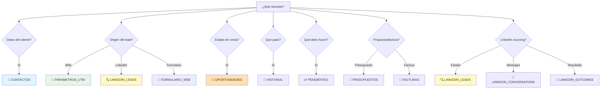

# 📊 CRM + LinkedIn Sourcing - Guía Visual Completa

## 🎯 ¿Qué tabla uso para...?



---

## 📋 TABLAS CORE (Uso diario en Budibase)

### 👤 **CONTACTOS** (Centro del universo)
> "¿Quién es esta persona/empresa?"

**Preguntas que responde:**
- ✅ ¿Cómo se llama? ¿Email? ¿Teléfono?
- ✅ ¿En qué empresa trabaja? ¿Qué cargo tiene?
- ✅ ¿Es Pyme, Startup, Agencia o Emprendedor?
- ✅ ¿Qué pack le corresponde? (GUARDIAN/MOTOR/FORTALEZA)
- ✅ ¿De dónde vino? (Web, LinkedIn, Manual)
- ✅ ¿Tiene LinkedIn? ¿Ficha de Google Maps?
- ✅ ¿Cuál es su lead score?

**Origen dual:**
```
Contactos desde WEB:
  - email (obligatorio)
  - origen = FORMULARIO_WEB
  - linkedin_url (opcional)

Contactos desde LINKEDIN:
  - linkedin_url (obligatorio)
  - origen = LINKEDIN_SOURCING
  - email (se obtiene después si acepta)
```

**Casos de uso en Budibase:**
```
Vista: Lista completa con búsqueda fuzzy
Detalle: Vista 360° con:
  - Datos básicos + LinkedIn + Places
  - Timeline (historial + formularios + LinkedIn)
  - Oportunidades activas
  - UTM tracking (si web)
  - LinkedIn lead status (si sourcing)
```

**Query típica:**
```sql
-- Contactos Hot del pack MOTOR
SELECT 
    nombre, 
    company_name, 
    pack_asignado, 
    lead_score
FROM contactos
WHERE pack_asignado = 'MOTOR'
  AND lead_score >= 70
  AND estado = 'ACTIVO'
ORDER BY lead_score DESC;
```

---

### 💼 **OPORTUNIDADES** (Pipeline unificado)
> "¿Qué oportunidades tengo? ¿De dónde vienen?"

**Preguntas que responde:**
- ✅ ¿Cuántas oportunidades abiertas tengo?
- ✅ ¿Vienen de formulario web o LinkedIn?
- ✅ ¿En qué estado están?
- ✅ ¿Cuánto valen?
- ✅ ¿Qué pack son?
- ✅ ¿Cuándo se espera cerrar?
- ✅ ¿Quién es el owner?

**Origen dual (clave):**
```
Oportunidades desde WEB:
  formulario_id: NOT NULL
  linkedin_lead_id: NULL

Oportunidades desde LINKEDIN:
  formulario_id: NULL
  linkedin_lead_id: NOT NULL

Oportunidades MIXTAS (raro pero posible):
  formulario_id: NOT NULL
  linkedin_lead_id: NOT NULL
  (contacto vino por LinkedIn, luego llenó formulario)
```

**Casos de uso en Budibase:**
```
Kanban: Pipeline visual
  - Nuevo | En contacto | Presupuesto | Ganado | Perdido
  - Drag & drop para mover
  - Color por prioridad
  - Icono para distinguir origen (🌐 Web / 💼 LinkedIn)

Dashboard: KPIs
  - Total pipeline value
  - Win rate por origen
  - Tiempo promedio de cierre
  - Por pack: GUARDIAN vs MOTOR vs FORTALEZA
```

**Query típica:**
```sql
-- Pipeline activo por origen
SELECT 
    CASE 
        WHEN formulario_id IS NOT NULL THEN 'WEB'
        WHEN linkedin_lead_id IS NOT NULL THEN 'LINKEDIN'
    END as origen,
    estado,
    COUNT(*) as num_deals,
    SUM(deal_value) as valor_total
FROM oportunidades
WHERE estado NOT IN ('Ganado', 'Perdido')
GROUP BY origen, estado;
```

---

### 🧾 **HISTORIAL** (Timeline universal)
> "¿Qué ha pasado con este contacto/deal/LinkedIn lead?"

**Preguntas que responde:**
- ✅ ¿Cuándo hablé con este cliente?
- ✅ ¿Qué se dijo en la última llamada?
- ✅ ¿Le envié mensaje por LinkedIn?
- ✅ ¿Cuántos touchpoints llevamos?
- ✅ ¿Cuánto tiempo invertido?

**Soporta 3 relaciones:**
```
Historial de CONTACTO:
  contacto_id: NOT NULL
  oportunidad_id: NULL
  linkedin_lead_id: NULL

Historial de OPORTUNIDAD:
  contacto_id: NULL
  oportunidad_id: NOT NULL
  linkedin_lead_id: NULL

Historial de LINKEDIN LEAD:
  contacto_id: NULL
  oportunidad_id: NULL
  linkedin_lead_id: NOT NULL
```

**Tipos específicos de LinkedIn:**
- `LINKEDIN_MESSAGE` - Mensaje enviado/recibido
- `LINKEDIN_INVITE` - Invitación enviada
- `LINKEDIN_CONVERSATION` - Interacción completa

**Casos de uso en Budibase:**
```
Timeline: Vista cronológica
  - Filtro por tipo de actividad
  - Iconos diferentes: 📞 Call | 📧 Email | 💼 LinkedIn
  - Vista detalle con notas completas
  - Archivos adjuntos (Supabase Storage)
```

---

### ✅ **PENDIENTES** (Tareas universales)
> "¿Qué tengo que hacer HOY?"

**Preguntas que responde:**
- ✅ ¿Qué tareas tengo pendientes?
- ✅ ¿Cuáles vencen hoy?
- ✅ ¿Tengo seguimientos de LinkedIn pendientes?
- ✅ ¿Qué está vencido?

**Soporta 3 relaciones** (igual que historial):
```
Tarea de seguimiento LinkedIn:
  linkedin_lead_id: NOT NULL
  title: "Follow-up: María García (MOTOR)"
  due_date: 2026-02-10

Tarea de oportunidad:
  oportunidad_id: NOT NULL
  title: "Enviar presupuesto Pack GUARDIAN"
  
Tarea de contacto:
  contacto_id: NOT NULL
  title: "Llamar para agendar demo"
```

**Casos de uso en Budibase:**
```
To-Do List: Tareas de hoy
  - Vencidas (rojo)
  - Hoy (naranja)
  - Próximos 7 días (amarillo)
  - Filtro por assigned_to
  - Icono de origen: 🌐 CRM | 💼 LinkedIn

Calendario: Vista semanal/mensual
  - Código de colores por prioridad
  - Drag & drop para reprogramar
```

---

## 📊 TABLAS CRM TRADICIONAL

### 🔗 **PARAMETROS_UTM**
> "¿De dónde vino este lead web?"

**Uso:** Solo para leads que vienen de campañas web (Google Ads, Bing Ads, LinkedIn Ads)

**Campos críticos:**
- `gclid` / `msclkid` / `li_fat_id` - Para conversiones offline
- `utm_source` / `utm_campaign` - Para atribución
- `device` / `placement` - Para análisis

**Query típica:**
```sql
-- ROI por campaña
SELECT 
    utm_campaign,
    COUNT(DISTINCT u.contacto_id) as leads,
    COUNT(DISTINCT CASE WHEN o.estado = 'Ganado' THEN o.id END) as ganados,
    SUM(CASE WHEN o.estado = 'Ganado' THEN o.deal_value END) as revenue
FROM parametros_utm u
LEFT JOIN oportunidades o ON u.contacto_id = o.contacto_id
WHERE utm_source = 'google'
GROUP BY utm_campaign
ORDER BY revenue DESC;
```

---

### 📝 **FORMULARIO_WEB**
> "¿Qué respondió el lead? ¿Qué problema tiene?"

**Uso:** Respuestas del formulario de contacto web

**Campos dinámicos según servicio:**
- Desarrollo web → `tipo_solucion`
- Cloud & DevOps → `situacion_infraestructura`
- SRE → `problema_fiabilidad`
- Infraestructura → `parte_infraestructura`
- Integraciones → `herramientas_conectar`
- Outsourcing IT → `tipo_soporte`

**Query típica:**
```sql
-- Servicios más solicitados
SELECT 
    servicio_relacionado,
    COUNT(*) as total,
    COUNT(DISTINCT contacto_id) as contactos_unicos
FROM formulario_web
WHERE submitted_at > NOW() - INTERVAL '30 days'
GROUP BY servicio_relacionado
ORDER BY total DESC;
```

---

### 📄 **PRESUPUESTOS**
> "¿Qué propuestas tengo enviadas?"

**Uso:** Gestión de presupuestos comerciales

**Estados:**
- Draft → Sent → Accepted/Rejected/Expired

**Query típica:**
```sql
-- Presupuestos pendientes de respuesta
SELECT 
    p.quote_number,
    c.nombre,
    c.company_name,
    p.quote_value,
    p.sent_at,
    CURRENT_DATE - p.sent_at::date as dias_enviado
FROM presupuestos p
JOIN contactos c ON p.contacto_id = c.id
WHERE p.status = 'Sent'
  AND p.valid_until >= CURRENT_DATE
ORDER BY p.sent_at ASC;
```

---

### 🧾 **FACTURAS**
> "¿Qué facturas están pendientes de cobro?"

**Uso:** Control de cobros y revenue

**Estados:**
- PENDING → PAID / OVERDUE

**Query típica:**
```sql
-- Facturas vencidas (urgente cobrar)
SELECT 
    f.invoice_number,
    c.nombre,
    f.invoice_value,
    f.due_date,
    CURRENT_DATE - f.due_date as dias_vencido
FROM facturas f
JOIN contactos c ON f.contacto_id = c.id
WHERE f.status = 'PENDING'
  AND f.due_date < CURRENT_DATE
ORDER BY f.due_date ASC;
```

---

### 🎯 **CONVERSIONES_OFFLINE**
> "¿Qué conversiones debo enviar a Google/Bing/LinkedIn?"

**Uso:** Feedback a plataformas de Ads para optimización

**Flujo:**
1. Oportunidad se marca como "Ganado"
2. Se crea registro con click_id (de parametros_utm)
3. Script automático envía a Google/Bing/LinkedIn
4. Status: PENDING → SENT / FAILED

**Query típica:**
```sql
-- Cola de envío pendiente
SELECT 
    co.platform,
    co.event_name,
    co.click_id,
    o.deal_name,
    co.conversion_value
FROM conversiones_offline co
JOIN oportunidades o ON co.oportunidad_id = o.id
WHERE co.sync_status = 'PENDING'
  AND co.retry_count < 3
ORDER BY co.created_at ASC
LIMIT 100;
```

---

## 🔍 TABLAS LINKEDIN SOURCING (Preparadas para futuro)

### 🎯 **LINKEDIN_LEADS** (Proceso completo de prospección)
> "¿En qué estado está este prospect de LinkedIn?"

**Estados del flujo:**
```
NEW → SCORING → INVITE_QUEUED → INVITE_SENT → PENDING
  ↓
ACCEPTED → Research → Draft → Approval → Conversation → CONVERTED
  ↓
NO_ACCEPT → SIGNAL_CHECK → RECYCLE_RETRY / ENGAGE_LATER / ARCHIVED
```

**Campos clave:**
- `pack_candidate` - ¿A qué pack pertenece?
- `lead_score` - Puntuación 0-100
- `status` - Estado actual del proceso
- `segment` - Para A/B testing
- `signal_changed` - ¿Hay señal nueva para reintentar?
- `research_data` - Resultados del research profundo

**Uso en Budibase (futuro):**
```
Dashboard LinkedIn:
  - Invites sent hoy/semana/mes
  - Acceptance rate por segmento
  - Time to accept promedio
  - Leads by status (embudo visual)
  - A/B test results

Vista Prospects:
  - Lista de leads por status
  - Filtros: pack, segment, score
  - Acciones: aprobar invite, ver research
```

**Query típica:**
```sql
-- Performance de A/B testing
SELECT 
    segment,
    ab_test_group,
    COUNT(*) as invites_sent,
    COUNT(*) FILTER (WHERE status = 'ACCEPTED') as accepted,
    ROUND(100.0 * COUNT(*) FILTER (WHERE status = 'ACCEPTED') / COUNT(*), 2) as acceptance_rate,
    AVG(EXTRACT(EPOCH FROM (accepted_at - invite_sent_at)) / 86400) as avg_days_to_accept
FROM linkedin_leads
WHERE invite_sent_at > NOW() - INTERVAL '7 days'
  AND ab_test_group IS NOT NULL
GROUP BY segment, ab_test_group
ORDER BY acceptance_rate DESC;
```

---

### 📝 **LINKEDIN_ATTEMPTS** (Auditoría completa)
> "¿Qué se ha intentado con este lead?"

**Tipos de intento:**
- `INVITE` - Invitación enviada
- `MESSAGE` - Mensaje enviado
- `RESEARCH` - Research realizado
- `SIGNAL_CHECK` - Verificación de señales
- `SCORE_UPDATE` - Actualización de score

**Uso:** Debugging, análisis de errores, auditoría

**Query típica:**
```sql
-- ¿Por qué se descartaron leads?
SELECT 
    reason,
    COUNT(*) as total
FROM linkedin_attempts
WHERE attempt_type = 'INVITE'
  AND result = 'SKIPPED'
  AND attempted_at > NOW() - INTERVAL '7 days'
GROUP BY reason
ORDER BY total DESC;
```

---

### ✅ **LINKEDIN_APPROVALS** (Control humano vía Telegram)
> "¿Qué mensajes están pendientes de aprobación?"

**Campos clave:**
- `draft_message` - Lo que generó la IA
- `ai_rationale` - Por qué la IA eligió ese mensaje
- `final_message` - Lo que realmente se envió (si se editó)
- `angle` - Feedback humano: Bueno/Regular/Incorrecto
- `pain_assessment` - ¿El dolor es Real/Superficial/Inventado?
- `human_note` - Nota del humano

**Uso:** Memoria operativa para mejorar la IA

**Query típica:**
```sql
-- Análisis de calidad de drafts IA
SELECT 
    angle,
    pain_assessment,
    COUNT(*) as total,
    COUNT(*) FILTER (WHERE approved = true) as aprobados
FROM linkedin_approvals
WHERE created_at > NOW() - INTERVAL '30 days'
GROUP BY angle, pain_assessment
ORDER BY total DESC;
```

---

### 💬 **LINKEDIN_CONVERSATIONS** (Mensajes completos)
> "¿Qué se dijo en LinkedIn?"

**Dirección:**
- `SENT` - Nosotros enviamos
- `RECEIVED` - Ellos respondieron

**Campos futuro (IA):**
- `sentiment` - POSITIVE / NEUTRAL / NEGATIVE
- `intent` - INTERESTED / NOT_INTERESTED / QUESTION

**Query típica:**
```sql
-- Conversaciones activas (con respuestas recientes)
SELECT 
    ll.full_name,
    ll.company,
    COUNT(*) as num_messages,
    MAX(lc.sent_at) as ultimo_mensaje
FROM linkedin_conversations lc
JOIN linkedin_leads ll ON lc.linkedin_lead_id = ll.id
WHERE lc.sent_at > NOW() - INTERVAL '7 days'
GROUP BY ll.id, ll.full_name, ll.company
HAVING COUNT(*) FILTER (WHERE direction = 'RECEIVED') > 0
ORDER BY ultimo_mensaje DESC;
```

---

### 🎯 **LINKEDIN_OUTCOMES** (Resultados finales)
> "¿Qué pasó al final con este prospect?"

**Outcomes posibles:**
- `BOOKED` - Agendó sesión Cal.com ✅
- `INTERESTED_LATER` - Interesado pero no ahora
- `NOT_FIT` - No es fit para ningún pack
- `GHOSTED` - Dejó de responder
- `CONVERTED` - Se convirtió en oportunidad

**Query típica:**
```sql
-- Tasa de conversión LinkedIn → Oportunidad
SELECT 
    ll.pack_candidate,
    COUNT(DISTINCT ll.id) as total_leads,
    COUNT(DISTINCT lo.id) FILTER (WHERE lo.outcome = 'BOOKED') as booked,
    COUNT(DISTINCT lo.id) FILTER (WHERE lo.outcome = 'CONVERTED') as converted,
    ROUND(100.0 * COUNT(DISTINCT lo.id) FILTER (WHERE lo.outcome = 'BOOKED') / COUNT(DISTINCT ll.id), 2) as booking_rate
FROM linkedin_leads ll
LEFT JOIN linkedin_outcomes lo ON ll.id = lo.linkedin_lead_id
WHERE ll.status = 'ACCEPTED'
GROUP BY ll.pack_candidate
ORDER BY booking_rate DESC;
```

---

## 🔄 FLUJOS DE TRABAJO TÍPICOS

### Flujo 1: Lead web llega
```
1. Usuario envía formulario → FORMULARIO_WEB
2. Se crea/actualiza contacto → CONTACTOS
   - origen = FORMULARIO_WEB
   - email (dedup)
3. Se guardan UTMs → PARAMETROS_UTM
4. Comercial califica → Crea OPORTUNIDAD
   - formulario_id = NOT NULL
   - linkedin_lead_id = NULL
5. Sistema asigna pack según respuestas
6. Se crea tarea de follow-up → PENDIENTES
```

### Flujo 2: LinkedIn sourcing (futuro)
```
1. Sistema identifica prospect → LINKEDIN_LEADS
   - status = NEW
   - linkedin_url (dedup)
2. IA clasifica pack → pack_candidate
3. IA calcula score → lead_score
4. Si score alto → Invitación LinkedIn
   - status = INVITE_SENT
   - Registro en LINKEDIN_ATTEMPTS
5. Si acepta → status = ACCEPTED
6. Research profundo (web + Places)
7. IA genera draft → LINKEDIN_APPROVALS
8. Humano aprueba vía Telegram
9. Enviar mensaje → LINKEDIN_CONVERSATIONS
10. Conversación → CTA Cal.com
11. Si acepta sesión → LINKEDIN_OUTCOMES
    - outcome = BOOKED
12. Crear OPORTUNIDAD
    - linkedin_lead_id = NOT NULL
    - formulario_id = NULL
13. Vincular contacto
    - linkedin_url → email (si obtuvimos)
```

### Flujo 3: Gestión diaria en Budibase
```
1. Abrir Dashboard
   - Ver KPIs: pipeline value, tareas vencidas
   - (Futuro) Ver LinkedIn: invites, acceptance rate
2. Revisar PENDIENTES
   - To-do de hoy
   - Seguimientos LinkedIn
3. Actualizar OPORTUNIDADES
   - Mover en Kanban
   - Registrar actividad → HISTORIAL
4. Enviar PRESUPUESTOS
   - Generar PDF
   - Marcar como Sent
5. Revisar FACTURAS vencidas
   - Contactar clientes
   - Marcar como Paid
```

---

## 📊 QUERIES ÚTILES PARA DASHBOARDS

### KPI: Funnel completo
```sql
SELECT 
    COUNT(DISTINCT fw.contacto_id) as total_leads_web,
    COUNT(DISTINCT ll.contacto_id) as total_leads_linkedin,
    COUNT(DISTINCT o.id) as total_oportunidades,
    COUNT(DISTINCT CASE WHEN o.estado = 'Ganado' THEN o.id END) as ganados,
    SUM(CASE WHEN o.estado = 'Ganado' THEN o.deal_value END) as revenue_total
FROM formulario_web fw
FULL OUTER JOIN linkedin_leads ll ON 1=1
LEFT JOIN oportunidades o ON (
    o.formulario_id = fw.id OR 
    o.linkedin_lead_id = ll.id
)
WHERE (fw.submitted_at > NOW() - INTERVAL '30 days' OR
       ll.created_at > NOW() - INTERVAL '30 days');
```

### KPI: Win rate por pack
```sql
SELECT 
    pack,
    COUNT(*) as total_deals,
    COUNT(*) FILTER (WHERE estado = 'Ganado') as ganados,
    COUNT(*) FILTER (WHERE estado = 'Perdido') as perdidos,
    ROUND(100.0 * COUNT(*) FILTER (WHERE estado = 'Ganado') / 
          NULLIF(COUNT(*) FILTER (WHERE estado IN ('Ganado', 'Perdido')), 0), 2) as win_rate
FROM oportunidades
WHERE created_at > NOW() - INTERVAL '90 days'
GROUP BY pack
ORDER BY win_rate DESC;
```

### KPI: Revenue mensual
```sql
SELECT 
    DATE_TRUNC('month', paid_date) as mes,
    COUNT(*) as num_facturas,
    SUM(invoice_value) as revenue,
    AVG(invoice_value) as ticket_promedio
FROM facturas
WHERE status = 'PAID'
  AND paid_date > NOW() - INTERVAL '12 months'
GROUP BY mes
ORDER BY mes DESC;
```

### KPI: LinkedIn performance (futuro)
```sql
SELECT 
    DATE_TRUNC('week', invite_sent_at) as semana,
    COUNT(*) as invites_sent,
    COUNT(*) FILTER (WHERE status = 'ACCEPTED') as accepted,
    ROUND(100.0 * COUNT(*) FILTER (WHERE status = 'ACCEPTED') / COUNT(*), 2) as acceptance_rate,
    AVG(EXTRACT(EPOCH FROM (accepted_at - invite_sent_at)) / 86400) as avg_days_to_accept
FROM linkedin_leads
WHERE invite_sent_at > NOW() - INTERVAL '8 weeks'
GROUP BY semana
ORDER BY semana DESC;
```

---

## ✅ RESUMEN: ¿Qué tabla para qué?

| Necesito... | Tabla | Cuando usarla |
|------------|-------|---------------|
| Ver datos del cliente | **CONTACTOS** | Siempre (centro del sistema) |
| Saber origen web | **PARAMETROS_UTM** | Solo leads web |
| Ver respuestas formulario | **FORMULARIO_WEB** | Solo leads web |
| Gestionar pipeline | **OPORTUNIDADES** | Ventas activas |
| Ver qué pasó | **HISTORIAL** | Timeline de actividades |
| Ver qué debo hacer | **PENDIENTES** | Tareas y seguimientos |
| Enviar propuesta | **PRESUPUESTOS** | Fase de presupuesto |
| Cobrar | **FACTURAS** | Post-venta |
| Optimizar Ads | **CONVERSIONES_OFFLINE** | Feedback a campañas |
| **LINKEDIN SOURCING (futuro):** |
| Gestionar prospects | **LINKEDIN_LEADS** | Prospección activa |
| Ver qué se intentó | **LINKEDIN_ATTEMPTS** | Auditoría |
| Aprobar mensajes | **LINKEDIN_APPROVALS** | Control humano |
| Ver conversaciones | **LINKEDIN_CONVERSATIONS** | Mensajes LinkedIn |
| Ver resultado final | **LINKEDIN_OUTCOMES** | Métricas de conversión |

---

## 🎯 Ventajas del diseño unificado

### ✅ Un solo contacto, múltiples orígenes
- Email web + LinkedIn URL → mismo contacto
- Deduplicación automática
- Timeline unificado

### ✅ Oportunidades desde cualquier origen
- `formulario_id` OR `linkedin_lead_id`
- Métricas separadas pero unificables
- Pipeline único

### ✅ Preparado para futuro sin cambios
- Tablas LinkedIn ya existen
- Solo activar cuando estés listo
- Cero migraciones

### ✅ Reporting unificado
- ROI web vs LinkedIn
- Win rate por origen
- Revenue total consolidado

---

¿Necesitas más detalles de alguna tabla específica? 🚀
